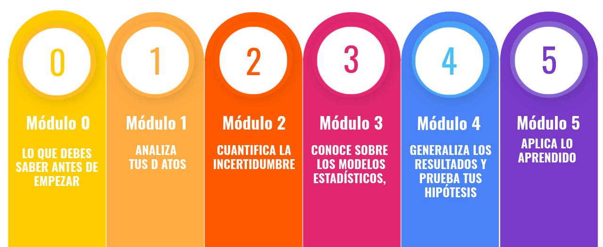
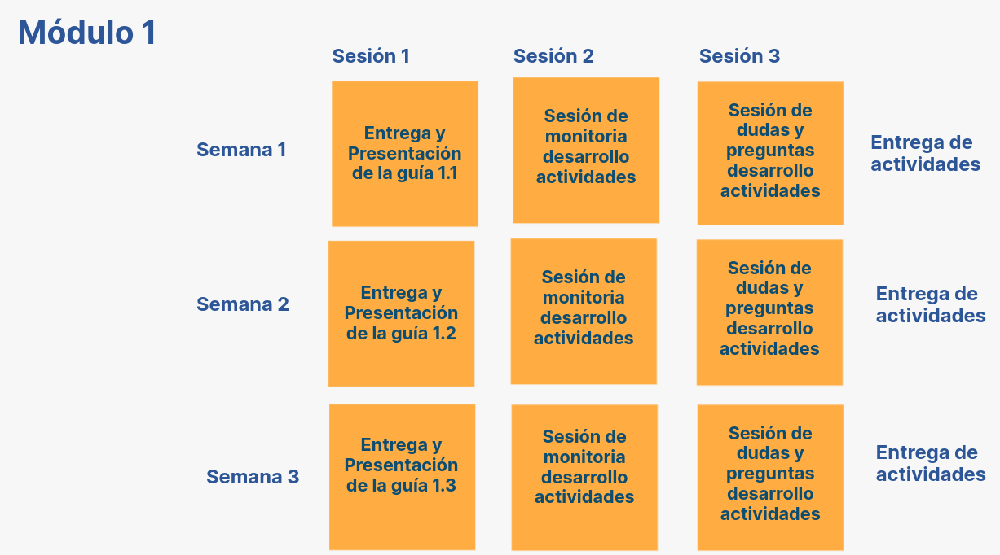
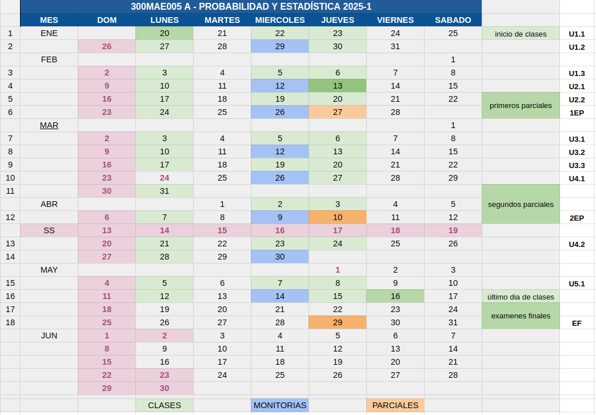
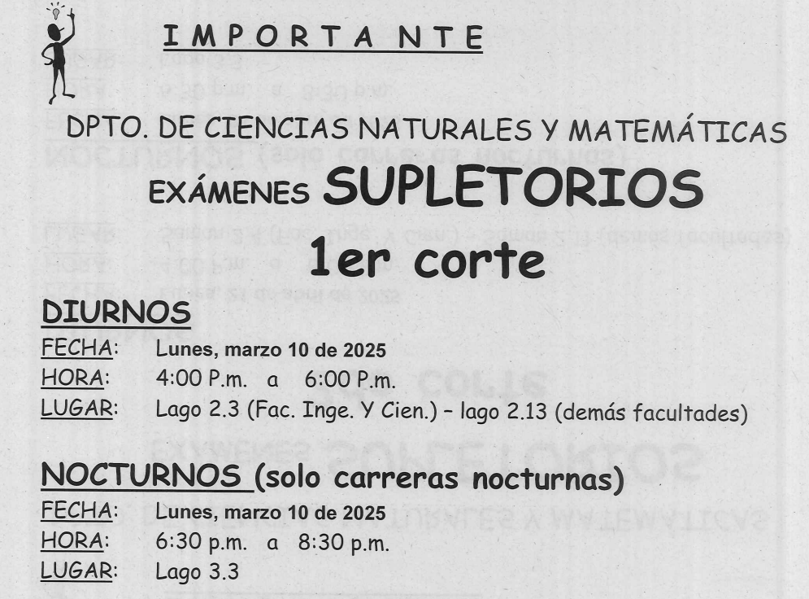

```{r setup, include=FALSE}
knitr::opts_chunk$set(echo = TRUE)

# colores
c0= "#FFCC00"
c1= "#FFAD42"
c2= "#FF5A42"
c3= "#E1286F"
c4= "#4983F6"
c5= "#783AC7"
c6= "#2C5697" # AZZUL INSTITUCIONAL
c7= "#F7F7F7" # FONDO GRIS CLARO WEB


```

## **300MAE005 - A**

<br/><br/>


```{r, echo=FALSE, out.width="100%", fig.align = "center"}
# knitr::include_graphics("img/bannerG.png")
```


<br/><br/><br/>


```{r, echo=FALSE, out.width="70%", fig.align = "center"}
 
```
<br/><br/>


## **Metodología**

<div class="box2"> 
```{r, echo=FALSE, out.width="100%", fig.align = "center"}

```

</div>

<br/><br/>

## **Calendario 2025-1**
<div class="box2">


<br/><br/>


```{r, echo=FALSE, out.width="100%", fig.align = "center"}
 
```

</div>

<br/><br/>

## **Salones de clase**
<div class="box2">

|Curso     | **Grupo** | Horario       | **LUNES**  |    **MARTES**  | **MIERCOLES** |  **JUEVES**    | **VIERNES** |
|:---------|:----------|:--------------|:-----------|:---------------|:--------------|:---------------|:------------|
|300MAE005 |  **A**    |9:00 a 11:00   |**EC 3.3**  |                |  **PL 2.5**   |**LG 4.4**      |             |
|          |           |               |Sesión 1    |                |  Monitoria/   |Sesión 3        |             |
|          |           |               |            |                |  Sesión 2     |                |             |


```{r, echo=FALSE, out.width="100%", fig.align = "center"}
 # knitr::include_graphics("img/salones.png")
```

</div>

<br/><br/>

<div class="box2">

#### **Profesor** : Daniel Enrique González Gómez 

dgonzalez@javerianacali.edu.co

<br/>

#### **Monitora** : Sara Isabella Salinas

</div>

<br/><br/>

## **Atención a Estudiantes**
<div class="box2">


```{r, echo=FALSE, out.width="100%", fig.align = "center"}
# knitr::include_graphics("img/atencion2.png")
```

</div>

<br/><br/>


## **Información supletorios**

<!-- <div class="box2"> -->

<!-- ### **DPTO. DE CIENCIAS NATURALES Y MATEMÁTICAS** -->
<!-- #### **EXÁMENES SUPLETORIOS - 1er corte** -->

<!-- **DIURNOS** -->

<!-- - **Fecha:** -->
<!-- - **Hora:**  -->
<!-- - **Lugar:**  -->

<!-- **NOCTURNOS (solo carreras nocturnas)** -->

<!-- - **Fecha:**  -->
<!-- - **Hora:**  -->
<!-- - **Lugar:**  -->


<!-- ```{r, echo=FALSE, out.width="70%", fig.align = "center"} -->
<!--  #  -->
<!-- ``` -->

<!-- </div> -->

<br/><br/>


```{r, echo=FALSE, out.width="100%", fig.align = "center"}
# knitr::include_graphics("img/calendario2023-1bre.png")
```


