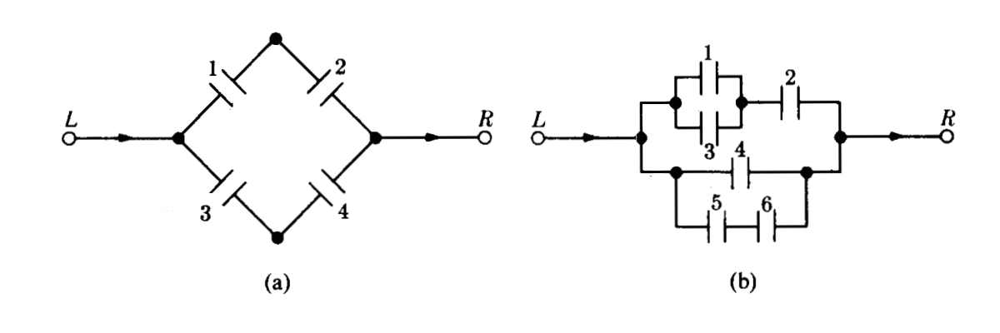

---
title: <span style="color:#235784"> </span>  
subtitle: <span style="color:#235784">**Módulo 2**</span> 
author: "dgonzalez "
output:
  html_document:
    toc: no
    toc_depth: 2
    toc_float: yes
    code_folding: hide
    theme: flatly
    css: style.css
---      

```{r setup, include=FALSE}
knitr::opts_chunk$set(echo = TRUE, message = FALSE, warning = FALSE, comment = NA)
library(psych)
library(summarytools)

# install.packages("devtools")
#devtools::install_github("dgonxalex80/paquete018")
#library(paquete018)


# colores
c0= "#FFCC00"
c1= "#FFAD42"
c2= "#FF5A42"
c3= "#E1286F"
c4= "#4983F6"
c5= "#783AC7"
c6= "#2C5697" # AZZUL INSTITUCIONAL
c7= "#F7F7F7" # FONDO GRIS CLARO WEB


```


```{r, echo=FALSE, out.width="100%", fig.align = "center"}
knitr::include_graphics("img/monitorias2.png")
```

</br></br></br>

# <span style="color:#2C5697"> **Problemas**</span> 

<br/>

<div class="box1 with-label">
<div class="label">Problema 1</div>  

Suponga que el conjunto universal consta de los números enteros del 1 al 10. 

Sea 

$A=\{2,3,4\}$, $B=\{3,4,5\}$, $C=\{5,6,7\}$  

Determine los elementos de los siguientes conjuntos:

+ $A \cap B$
+ $A' \cap B$
+ $(A \cap B)'$
+ $(A' \cap B')'$
+ $A \cap (B \cup C)'$
+ Represente los conjuntos $A$, $B$ y $C$ en un diagrama de Venn (John Venn-1880)

</div>

</br></br></br>

<div class="box1 with-label">
<div class="label">Problema 2</div>  

Suponga que el conjunto $U$ está dado por $U = \{ x | 0 \leq x \leq 2 \}$ . Sean los conjuntos `A` y `B` definidos como: 

$$A=\{ x | 1/2 \leq x \leq 1\}$$  
$$B = \{x|1/4 \leq x \leq 3/4 \}$$  

Describa los siguientes conjuntos:

+ $A \cup B$
+ $A \cup B'$
+ $A \cap B'$
+ $(A \cap B)'$
+ Represente gráficamente los conjuntos solicitados

</div>

</br></br></br>


<div class="box1 with-label">
<div class="label">Problema 3</div>  


Un cargamento de 1500 lavadoras contiene 400 defectuosas y 1100 no defectuosas. Se eligen al azar doscientas lavadoras (sin sustitución) y se clasifican. 

a. ¿Cual es la probabilidad de que se encuentren exactamente 50 artículos defectuosos?, 
b. ¿?Cual es la probabilidad de que se encuentren al menos 50 artículos defectuosos? 
c. ¿ entre 50 y 60 artículos defectuosos?


</div>

<br/><br/><br/>

<div class="box1 with-label">
<div class="label">Problema 4</div>  

Diez fichas numeradas del 1 al 10 se mezclan en una urna. Se sacan de la urna dos fichas numeradas `(X,Y)` una y otra a la vez sin sustitución. ¿Cuál es la probabilidad de que `X+Y=10` ?

</div>

<br/><br/><br/>


<div class="box1 with-label">
<div class="label">Problema 5</div>  


Un lote consta de 10 artículos buenos, 4 con pequeños defectos y 2 con defectos graves. Se elige un artículo al azar. Encontrar la probabilidad de que : 

+ No tenga defectos, 
+ Tenga defecto grave, 
+ Que sea bueno o tenga un defecto grave
	
</div>	
	
<br/><br/><br/>

<div class="box1 with-label">
<div class="label">Problema 6</div>  

Un mecanismo puede ponerse en cuatro posiciones digamos `a`, `b`, `c` y `d` . Hay 8 de tales mecanismos en un sistema. 

+ ¿De cuántas maneras diferentes se puede instalar el sistema ?, 
+ ¿Cuantas maneras son posibles si sólo se usan las posiciones `a` y `b` con la misma frecuencia?


</div>

<br/><br/><br/>

<div class="box1 with-label">
<div class="label">Problema 7</div>  


Entre los números $1,2,3 .... 50$ se escoge un número al azar. ¿Cuál es la probabilidad de que el número escogido sea divisible por `6` o por `8`?
	
</div>	
	
<br/><br/><br/>

<div class="box1 with-label">
<div class="label">Problema 8</div>  


La urna 1 contiene `x` bolas blancas e `y` bolas rojas. La urna 2 contiene `z` bolas blancas y `v` bolas rojas. Se escoge una bola al azar de la urna 1 y se pone en la urna 2. Entonces se escoge una bola al azar de la urna 2. ¿Cuál es la  probabilidad de que esta bola sea blanca?


</div>
	
<br/><br/><br/>

<div class="box1 with-label">
<div class="label">Problema 9</div>  


En las siguientes figuras (a) y (b) se supone que la probabilidad de que cada interruptor  este cerrado es `p`  y que cada  interruptor se abre o se cierra independientemente de cualquier otro. Encontrar en cada caso la probabilidad de la corriente pase de *Izquierda* a *Derecha*
	
```{r, echo=FALSE, out.width="70%", fig.align = "center"}

```


*Ejercicios tomados de Meyer( 1986)	*

</div>

<br/><br/><br/>

<div class="box1 with-label">
<div class="label">Problema 10</div>  


Los contaminantes más comunes de las aguas son de origen orgánico. Puesto que la mayor parte de los materiales orgánicos se descompone por acción de bacterias que requieren oxígeno, un exceso de materia orgánica puede significar una disminución en la cantidad de oxígeno disponible. Ello afecta eventualmente a otros organismos presentes en el agua. La demanda de oxígeno por parte de una bacteria se llama demanda biológica de oxígeno (DBO). Un estudio de las corrientes acuáticas que circulan en las proximidades de un complejo industrial revela que el 35% tiene una alta DBO, el 10% 	muestra una acidez elevada y un 4% presenta ambas características. ¿Son independientes los sucesos «la corriente tiene una alta DBO» y «la corriente posee una acidez elevada»? Calcular la probabilidad de que la corriente tenga una acidez elevada, dado que presenta una alta DBO.
	
	
</div>

<br/><br/><br/>

<div class="box1 with-label">
<div class="label">Problema 11</div>  


Suponga que una familia tiene cuatro hijos.  

+ Represente los eventos en un diagrama de árbol
+ Hallar la probabilidad de que exactamente dos sean varones. 
+ Cuál es la probabilidad de que dos sean varones si el nacido en primer lugar es un varón?. 
+ ¿Cuál es la probabilidad de que el último hijo nazca varón si los tres primeros son mujeres?
	

</div>

<br/><br/><br/>

<div class="box1 with-label">
<div class="label">Problema 12</div>  


Unos estudios muestran que los ejemplares de una cierta raza de liebres de alta montaña (liebre esquiadora) mueren antes de lo normal, aun en ausencia de depredadores o de 	enfermedad conocida alguna. Dos de las causas de muerte identificadas son: baja cantidad de azúcar en sangre y convulsiones. Se estima que el 7% de los animales presenta ambos síntomas, el 40% tiene bajo nivel de azúcar en sangre, y el 25% sufre convulsiones. 

+ ¿Cuál es el porcentaje de muertes producidas por causas que no sean las que hemos mencionado? 
+ ¿Cuál es la probabilidad de que un animal elegido aleatoriamente que tiene bajo nivel de azúcar en sangre sufra también convulsiones?

</div>
	
<br/><br/><br/>


<div class="box1 with-label">
<div class="label">Problema 13</div>  


Se cree que la distribución de los grupos sanguíneos en Estados Unidos en la Segunda Guerra Mundial era: `tipo A`, 41%; `tipo B`, 9%; `tipo AB`, 4%; y `tipo O`, 46%. Se estima que en esa época, el 4% de las personas pertenecientes al `tipo O` fue clasificado como del `tipo A`; el 88% de los del `tipo A` fue correctamente clasificado; el 4% de los del `tipo B` se clasificó como del `tipo A`, y el 10% de los del `tipo AB` fue, igualmente, clasificado como del `tipo A`. Un soldado fue herido y conducido a la enfermería. Se le clasificó como del `tipo A`. ¿Cuál es la probabilidad de que tal grupo sea ciertamente el suyo?
	
*Tomados de J. Susan Milto (2001)* 

</div>

<br/><br/><br/>

<div class="box1 with-label">
<div class="label">Problema 14</div>  


En el colegio Anglo-Frances se imparten sólo los idiomas inglés y francés. El 80% de los alumnos estudian  inglés y el resto francés. El 30% de los alumnos que cursan de inglés son socio del club musical del colegio, mientras de los que estudian francés son socio de dicho club el 40%. Si el director del colegio elige un alumno de manera aleatoria, ¿qué tan probable es que dicho alumno pertenezca al club de musical? . Por otra parte el psicólogo del colegio afirma que estudiar inglés es un evento independiente de estudiar francés. ¿usted que opina respecto a esta afirmación? (justifique su respuesta)

</div>

<br/><br/><br/>

<div class="box1 with-label">
<div class="label">Problema 15</div>  


En una universidad de la región hay 4134 estudiantes distribuidos en tres grupos. Primeros semestre (1 a 3), mitad de carrera (4 a 7) y final de carrera (8 a 10). Esta población esta conformada por estudiantes que realizan actividades extracuricolares y aquellos que no participan en ninguna actividad, distribuidos como se muestra en la siguiente tabla:

|                   |Participa en actividades del MU| No participa en actividades del MU |
|:------------------|:------------------------------|:-----------------------------------|
|Primeros semestres |   1250                        |   1530                             |
|Mitad de carrera   |    465                        |    350                             |
|Final de carrera   |    270                        |    270                             |

Se ha encomendado a un grupo de profesores consejeros, seleccionar un estudiante de este grupo para guiarlos académicamente en su proceso de formación. El grupo de profesores está conformado por Sandra, Isabel, David, Daniel y Gerardo

Sandra prefiere que el grupo de estudiantes a su cargo sean estudiantes de primeros semestre y que participan en actividades del Medio Universitario (MU) . Isabel en cambio los eligirá dentro del grupo de estudiantes que está finalizando carrera, dentro de los que prefieren no participar en actividades del MU. Por su parte David desea estudiantes sean del rango intermedio o mitad de carrera, pues ellos no han realizado la escogencia del énfasis. Daniel solicita un listado de los estudiantes que participan  e actividades del MU y de ellos desea que el estudiante a su cargo esté cursando últimos semestre. Finalmente Gerardo solo quiere que el estudiante seleccionado para su acompañamiento sea de primeros semestre.  Si en cada caso los estudiantes son selecionados de maneta aletatoria de toda la población tiene la mayor probabilidad de ver cumplido sus deseos?


</div>

<br/><br/><br/>

<div class="box1 with-label">
<div class="label">Problema 16</div>  


Un miembro de la comunidad universitaria se somete a una prueba para detectar el Covid19. Si la persona está enferma, el test dá positivo con un 96% de certeza. Si la persona está sana, el test será negativo con un 94% de certeza. Se sabe que 1 de cada 100 personas de esta comunidad está enferma

+ Sabemos que el test resultó positivo. Que tan probable es que la persona a la que le realizaron la prueba esté enferna?
+ El test resultó negativo. ¿Cual será la probabilidad de que la persona examinada este sana?

</div>

<br/><br/><br/>

<div class="box1 with-label">
<div class="label">Problema 17</div>  

Se escogen al azar 5 lámparas de 25 de las cuales 8 son defectuosas. Hallar la probabilidad de que:
<br/>
a. Ninguna de las lámparas seleccionadas sea defectuosa.
b. Exactamente una de las lámparas seleccionadas sea defectuosa.
c. Por lo menos una de las lámparas seleccionadas no sea defectuosa


</div>

<br/><br/><br/>

<div class="box1 with-label">
<div class="label">Problema 18</div>  

Un estudiante realiza dos exámenes en un mismo día. La probabilidad de que apruebe el primer examen  es de 0.6 . La probabilidad de que apruebe el segundo examen es de 0.8; y la de que apruebe los dos exámenes es 0.5 :

a. Represente la información suministrada mediante: 
    + Una tabla cruzada, con las probabilidades marginales, conjuntas y condicionales 
    + Diagrama de árbol,  
    + Un diagrama de Venn


b. Que es más probable que ocurra :
    + Que sabiendo que gane el primer examen, también gane el segundo examen
    + Que sabiendo que perdió el primer examen, también pierda el segundo examen


</div>

<br/><br/><br/>


<div class="box1 with-label">
<div class="label">Problema 19</div>  

El Departamento de crédito de una cadena de supermercados, informó que el 30% de sus ventas se pagan con efectivo o con cheque; 30% se paga con tarjeta de crédito y el resto con tarjeta débito. Veinte por ciento de las ventas realizadas con efectivo o cheque, noventa por ciento de las compras realizadas con tarjeta de crédito y el sesenta por ciento de las compras realizadas con tarjeta débito, son realizadas por más de  50.000. La señora Fatima acaba de comprar un vestido nuevo que le costó  120.000. ¿Que es más probable que halla pagado su vestido con tarjeta de crédito o que lo halla hecho con tarjeta débito?


</div>

<br/><br/><br/>


<div class="box1 with-label">
<div class="label">Problema 20</div>  


En una fábrica de artículos para protección biodegradables, cuatro operarios colocan etiquetas de caducidad en cada artículo al final de la línea de producción. Juan, quien coloca la fecha de caducidad en un 40 % de los paquetes no logra ponerla en uno de cada 200 paquetes; Nicolle, quien coloca en 30 % de los paquetes, no logra colocarla en uno de 100 paquetes; Sara, quien coloca etiquetas en el 15 % de los paquetes, no lo hace una vez en 90 paquetes; y Nelson que fecha 15 % de los paquetes, falla en uno de cada 200 paquetes. Si un cliente se queja de que su paquete no muestra la fecha de caducidad. ¿Cuál de los empleados es el más probable culpable de esta omisión?

</div>

<br/><br/><br/>


<div class="box1 with-label">
<div class="label">Problema 21</div>  

Uno de los laboratorios de la universidad tiene un esquema para recibir sus pedidos de insumos para sus investigadores. El plan tiene dos etapas. Primero el laboratorista selecciona una caja de 15 artículos y luego en una segunda etapa, extrae una muestra de 3 de ellos y los examina en búsqueda de defectos. Si no se encuentran artículos defectuosos en la revisión, el pedido es aceptado y es recibido por los encargados de la oficina de compras. En caso contrario, se regresa a su proveedor con el fin de que revise la totalidad de los artículos y se cerciore que todos están buenos. Por experiencia se estima que por cada caja de 15 artículos, hay 3 defectuosos, debido a problemas en el transporte. Bajo este esquema, ¿qué tan probable es que un pedido sea aceptado?  

</div>

<br/><br/><br/>


<div class="box1 with-label">
<div class="label">Problema 22</div>  

Examen de drogas Muchas universidades aplican exámenes para detectar el uso de drogas en estudiantes, con la finalidad de mejorar la salud y el bienestar en el campus, y reducir el riesgo de comportamiento inapropiado, accidentes y problemas académicos. Las personas que se oponen a esta práctica argumentan que este procedimiento puede etiquetar injustamente a algunos estudiantes, dado que las pruebas no son 100% confiables. Supongamos que una universidad utiliza una prueba con un 98% de exactitud, la cual identifica a un estudiante como usuario o no usuario de drogas con una probabilidad de .98. Para reducir la posibilidad de error, se solicita a cada estudiante que realice dos pruebas. Si los resultados de las dos pruebas en el mismo estudiante son eventos independientes, ¿cuáles son las probabilidades de los siguientes eventos?

a. Un estudiante que no consume drogas falle ambas pruebas.

b. Se detecte a un estudiante como usuario de drogas (falla en al menos una prueba).

c. Un estudiante que consume drogas pase ambas pruebas.

</div>

<br/><br/><br/>

<div class="box1 with-label">
<div class="label">Problema 23</div> 

Aquí tienes una versión revisada del enunciado:

En el campo de la genética vegetal, Gregor Mendel, un monje pionero, propuso en 1865 una teoría de la herencia. Mendel observó que los individuos heterocigotos para el color de la flor poseen dos alelos: uno *r* (alelo recesivo, que da lugar a flores blancas) y uno *R* (alelo dominante, que produce flores rojas). Al cruzar estos individuos, se obtuvo una descendencia en la que 3/4 presentaron flores rojas y 1/4 flores blancas. La tabla a continuación resume este acoplamiento, en el que cada padre aporta uno de sus alelos para conformar el gen de la descendencia.


```{r}
library(kableExtra)

# Definir los datos de la tabla
tabla <- data.frame(
  "Padre 1" = c("**r**", "**R**"),
  "rr" = c("rr", "Rr"),
  "rR" = c("rR", "RR")
)

# Cambiar nombres de las columnas para que coincidan con la tabla original
colnames(tabla) <- c("**Padre 1**", "rr", "rR")

# Crear la tabla usando kable y kableExtra para mejorar la presentación
kable(tabla, align = c("c", "c", "c"), escape = FALSE, col.names = c("**Padre 1**", "**r**", "**R**")) %>%
  kable_styling(bootstrap_options = c("striped", "hover", "condensed", "responsive")) %>%
  add_header_above(c(" " = 1, "**Padre 2**" = 2))

```


Se supone que cada padre tiene las mismas probabilidades de dar cualquiera de los alelos y que, si alguno de los dos es dominante (R), la descendencia tendrá las flores rojas.

a. ¿Cuál es la probabilidad de que una descendencia de esta unión tenga por lo menos un alelo dominante?

b. ¿De que una descendencia tenga por lo menos un alelo recesivo?

c. ¿Cuál es la probabilidad de que una descendencia tenga un alelo recesivo, dado que tiene las flores rojas?


</div>

<br/><br/><br/>


<div class="box1 with-label">
<div class="label">Problema 24</div> 


En una universidad de la región hay 4000 estudiantes distribuidos en tres grupos. Primeros semestre (1 a 3), mitad de carrera (4 a7) y final de carrera (8 a 10). Esta población esta conformada por estudiantes que realizan actividades extracuricolares y aquellos que no participan en ninguna actividad, distribuidos como se muestra en la siguiente tabla:

```{r, fig.align='center', fig.width=6}
library(knitr)

x <- c(1250, 465, 270, 1530, 350, 270)
m <- matrix(x, nrow = 3)
colnames(m) <- c("MU", "MU*")
rownames(m) <- c("Primeros semestres", "Mitad de carrera", "Final de carrera")

kable(m, caption = "Tabla de Resultados por Etapa de la Carrera", align = "c")

```

* **MU** : Participa de actividades programadas por el Medio Universitario
* **MU* ** : No participa de actividades programadas por el Medio Universitario

<br/>

Se ha encomendado a un grupo de profesores consejeros, seleccionar un estudiante de este grupo para guiarlos académicamente en su proceso de formación. El grupo de profesores está conformado por Sandra, Isabel, David, Daniel y Gerardo
			
Sandra prefiere que el grupo de estudiantes a su cargo sean estudiantes de primeros semestre y que participan en actividades del Medio Universitario (MU) . Isabel en cambio los eligirá dentro del grupo de estudiantes que está finalizando carrera, dentro de los que prefieren no participar en actividades del MU. Por su parte David desea estudiantes sean del rango intermedio o mitad de carrera, pues ellos no han realizado la escogencia del énfasis. Daniel solicita un listado de los estudiantes que participan  e actividades del MU y de ellos desea que el estudiante a su cargo esté cursando últimos semestre. Finalmente Gerardo solo quiere que el estudiante seleccionado para su acompañamiento sea de primeros semestre.  Si en cada caso los estudiantes son seleccionados de manera aleatoria de toda la población tiene la mayor probabilidad de ver cumplido sus deseos?

</div>

<br/><br/><br/>