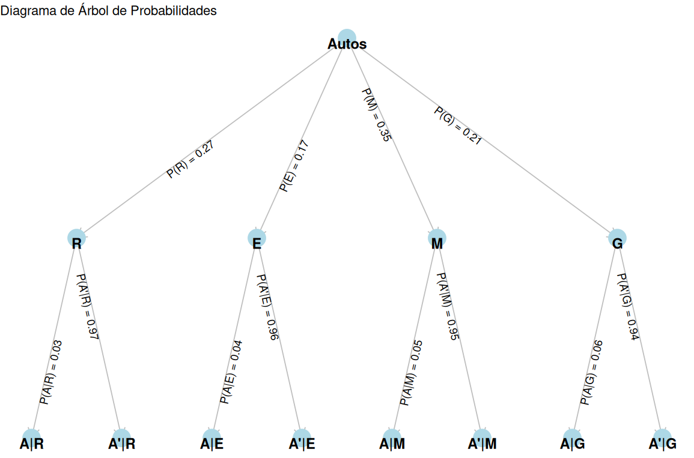
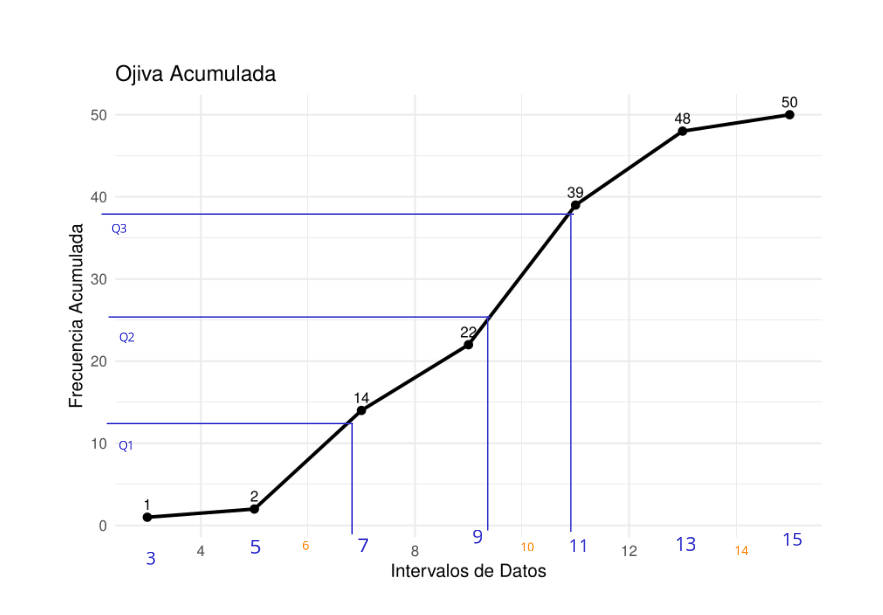

---
title: <span style="color:#235784"> </span>  
subtitle: <span style="color:#235784">**Módulo 3**</span> 
author: "dgonzalez "
output:
  html_document:
    toc: no
    toc_depth: 2
    toc_float: yes
    code_folding: hide
    theme: flatly
    css: style.css
---      


```{r setup, include=FALSE}
knitr::opts_chunk$set(echo = TRUE, comment = NA)
library(gt)
library(tidyverse)
```

**PONTIFICIA UNIVERSIDAD JAVERIANA CALI**  
Departamento de Ciencias Naturales y Matemáticas  
300MAE005 Probabilidad y Estadística - grupo A  

<div style="text-align: right;">
<strong>Profesor:</strong> Daniel Enrique González Gómez  
Cali, febrero 27 de 2025  
</div>

<div style="text-align: center;">
<strong>PRIMER EXAMEN PARCIAL</strong>
</div>

<br/><br/>

## Punto 1

Una compañía de seguros de automóviles trabaja con cuatro tipos de autos: **Rayquaza, Etenatus, Mewtwo y Groudon**, sobre los que cuenta con la siguiente información:

| Marca            | Proporción de autos | Probabilidad de **A**ccidente |
|-------------------|--------------------|-------------------------------|
| **R** : Rayquaza  |   $P(R)=0.27$      |   $P(A|R) =0.03$              |
| **E** : Etenatus  |   $P(E)=0.17$      |   $P(A|E) =0.04$              |
| **M** : Mewtwo    |   $P(M)=0.35$      |   $P(A|M) =0.05$              |
| **G** : Groudon   |   $P(G)=0.21$      |   $P(A|G) =0.06$              |

Construya un diagrama de árbol que represente la información suministrada y a partir de los resultados obtenidos, ayude al gerente de la compañía a conocer qué marca tiene mayor probabilidad de accidente si se sabe que ha ocurrido un accidente (**A**). Construya un listado de mayor a menor.

<br/><br/>

### **Solución**


```{r, echo=FALSE, out.width="80%", fig.align = "center"}

```


A partir de la identificación de las probabilidades de la tabla procedemos a calcular las probabilidades conjuntas:

```{r}
P = c(0.27, 0.17, 0.35, 0.21)
C = c(0.03,0.04,0.05,0.06)

P*C
```


```{r}
p = P*C/sum(P*C)
names(p) = c("(3):P(R|A)", "(4):P(E|A)", "(1):P(M|A)", "(2):P(G|A)" )
p

```


<br/><br/><br/>

## Punto 2

Una de las principales medidas de la calidad de servicio en una organización es la rapidez con la que responde a quejas de clientes. El Centro de Servicios Informáticos de la Universidad está interesado en disminuir el tiempo de atención a quejas relacionadas con el mal funcionamiento de las máquinas virtuales. Se ha seleccionado una muestra con los siguientes tiempos de atención en minutos:


```{r, echo=FALSE, out.width="80%", fig.align = "center"}
knitr::include_graphics("img/ojiva.png")
```


<!-- ``` -->
<!-- 2  | 3 -->
<!-- 4  | 4 -->
<!-- 6  | 4 7 8 1 1 1 3 4 5 5 8 9 -->
<!-- 8  | 1 3 0 0 4 5 6 7 -->
<!-- 10 | 1 6 6 6 8 8 9 9 9 9 0 3 5 5 5 5 8 -->
<!-- 12 | 1 4 5 7 1 1 3 8 8 -->
<!-- 14 | 6 2 -->
<!-- ``` -->

<!-- ``` -->
<!-- 10.6  10.9   13.3   11.5   11.5    9.0    7.1   10.8   13.1 -->
<!--  8.1  14.6    9.4   12.1    7.1    7.3    6.8   13.1   10.8 -->
<!-- 13.8   9.6   11.5    6.7    7.8    9.7    9.5    7.5   10.1 -->
<!-- 12.7  12.5    7.1   10.9   10.6   12.4   10.6    9.0    7.5 -->
<!-- 11.5   7.4   11.3   11.8    6.4    2.3   15.2    5.4   10.9 -->
<!-- 8.3   10.9    7.9   13.8   11.0 -->
<!-- ``` -->

* $\sum_{i=1}^{50} x_i = 500.7$

* $\sum_{i=1}^{50} x_i^2 = 5869.69$

* $\sum_{i=1}^{50} (x_i - \bar{x})^2 = 336.4$


La auditoría desea verificar si el Centro Informático cumple los siguientes lineamientos:

1. No poseer datos atípicos.
2. No exceder las 10 horas en más del 5% de la muestra.
3. Tener un 80% de los tiempos por debajo de 8 horas.
4. Tener una distribución con asimetría positiva.

El responsable de la auditoría le solicita revisar el cumplimiento de estos lineamientos y generar un informe breve.


<br/><br/>

### **Solución**

Primero vamos que valores corresponden las frecuiencias acumuladas registradas en la gáfica

```{r, echo=FALSE, out.width="80%", fig.align = "center"}
knitr::include_graphics("img/ojivaP12.png")
```

```{r, echo=FALSE}
FX =data.frame(
x = c(3,5,7,9,11,13,15),
Fx = c(1,2,14,22,39,48,50))


```

Tambien requerimos estimar los valores de $Q_1$, $Q_2$ y $Q_3$

```{r, echo=FALSE, out.width="80%", fig.align = "center"}

```

```{r, echo=FALSE}
Q =c(6.7, 9.2, 10.8)
names(Q) = c("Q1", "Q2", "Q3")
Q
```

Otros datos que podemos obtener de la información suministrada son la media y la varianza


```{r}
media = 500.7/50
varianza = 336.4

cat("media = ", media, "\n" )
cat("varianza = ", varianza)

```


Con esta información daremos respuesta a los interrogantes


1. No poseer datos atípicos.

```{r}
LI = Q[1]- 1.5*Q[3]-Q[1]
LS = Q[3]+ 1.5*Q[3]-Q[1]

cat("Límite inferior ", LI, "\n")
cat("Límite superior ", LS )
```

Dado que el gráfico indica que no existen valores inferiores a 3, ni superiores a 15, podemos afirmar que no existen datos atípicos


2. No exceder las 10 horas en más del 5% de la muestra.

Este requerimiento lo podemos resolver observando la cantidad de datos que tienen valor de 10 o menos 

```{r, echo=FALSE, out.width="80%", fig.align = "center"}
knitr::include_graphics("img/ojiva10.png")
```

En ella se observa que 30 datos presentan un valor de 10 o menos los cuales representan el 60% (30/50 =0.6). Lo cual indica que este requerimiento no se cumple

3. Tener un 80% de los tiempos por debajo de 8 horas.

```{r, echo=FALSE, out.width="80%", fig.align = "center"}
knitr::include_graphics("img/ojiva08.png")
```


Al observar la gráfica tenemos que aproximadamente 18 de los datos tienen valores iguales o inferiores a 8 (18/50 = 36). Indica esto que el 36% de los datos presentan valores iguale o inferiores a 8.  Este requerimiento tampoco se cumple


4. Tener una distribución con asimetría positiva.

Para ello tenemos dos obsiones : 

Primero comparando la media y la mediana:

* Si $\bar{x} \approx Me$, la distribución se considera SIMETRICA 
* Si $\bar{x} > Me$ , la distribución es ASIMETRICA A  LA DERECHA o POSITIVA
* Si $\bar{x} < Me$ , la distribución es ASIMETRICA A LA IZAQUIERDA o NEGATIVA


```{r}
cat("mediana : ",Q[2], "\n")
cat("media   : ",media)
```

Los resultados indican una leve asimetria a la derecha


El responsable de la auditoría le solicita revisar el cumplimiento de estos lineamientos y generar un informe breve.

Los anteriores resultados indican que NO se cumplen 3 de los lineamientos decretados por la empresa para la atención de sus clientes. Se recomienda realizar una revisión de todo el proceso y así poder encontrar soluciones que mejore este servicio.

